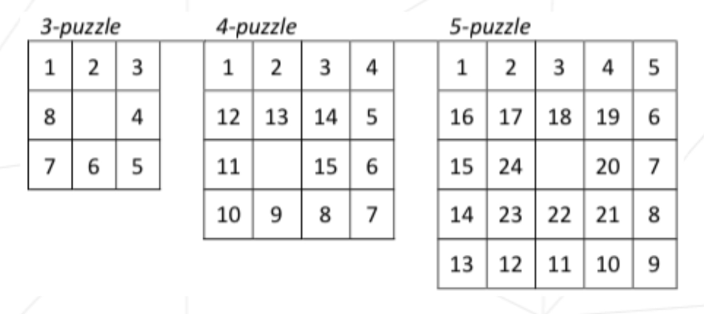
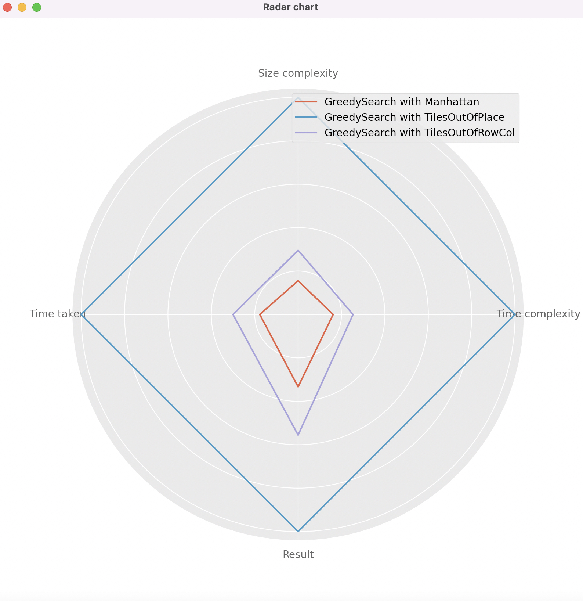
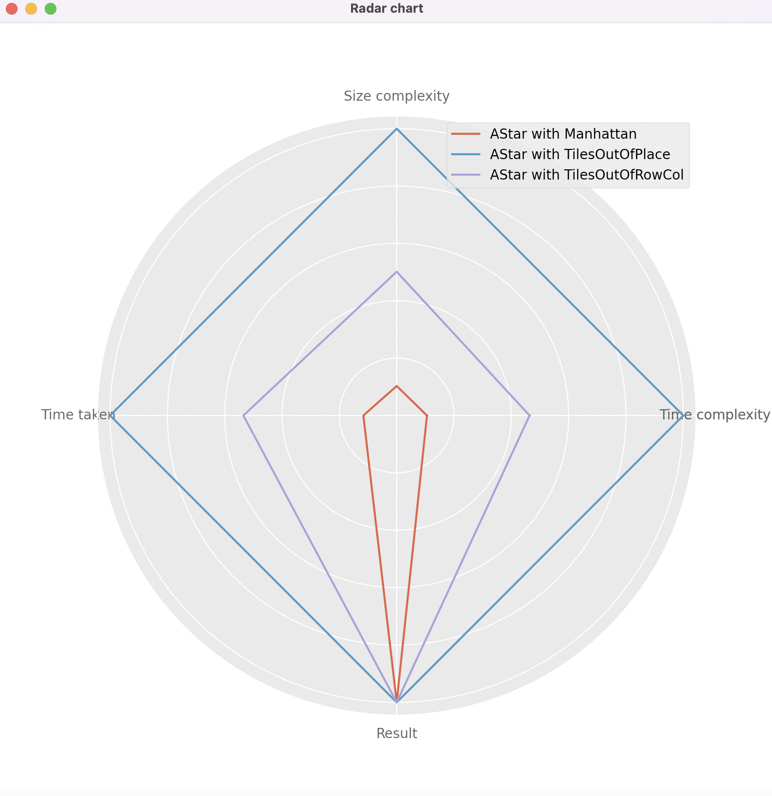
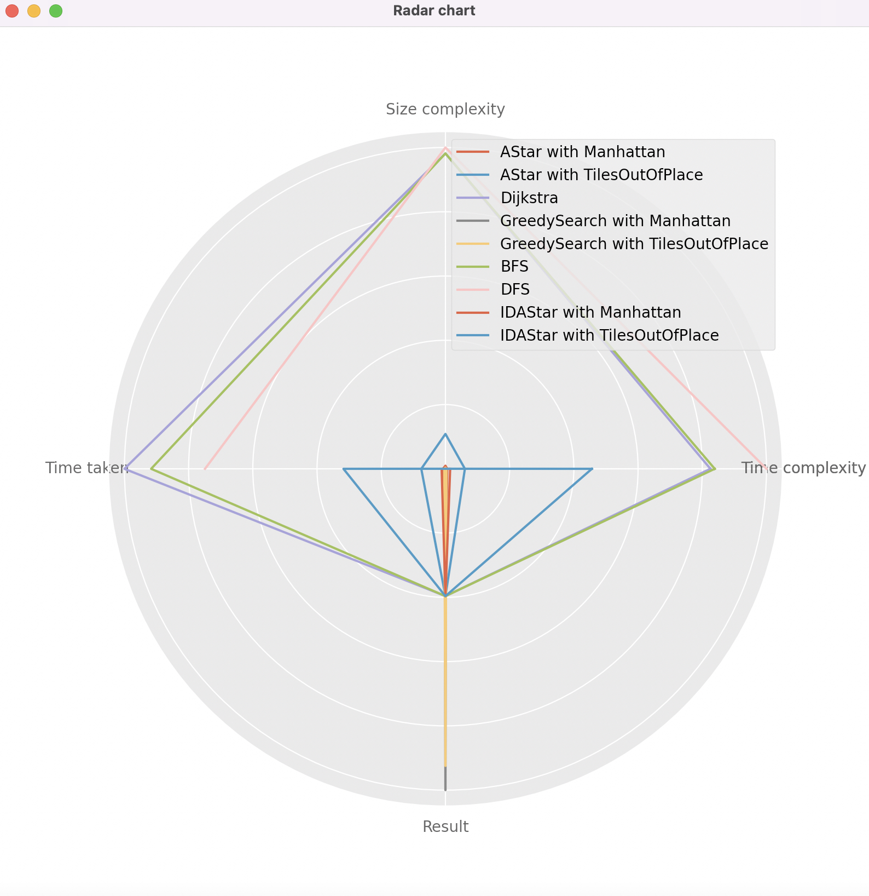

<!---
allespag, 2022
-->

# n-puzzle

The goal of this project is to solve the N-puzzle ("taquin" in French) game using the A* search algorithm or one of its variants.

You start with a square board made up of N*N cells. One of these celles will be empty, the others will contain numbers, starting from 1, that will be unique in this instance of the puzzle.

You search algorithm will have to find a valid sequence of moves in order to reach the final state, a.k.a the "snail solution", which depends on the size of the puzzle (Example below). While there will be no direct evaluation of its performance in this instance of the project, it has to have at least a vaguely reasonable performance : Taking a few second to solve a 3-puzzle is pushing it, ten seconds is unacceptable.



The only move one can to in the N-puzzle is to swap the empty cell with one of its neighbors (No diagonals, of course. Imagine you're sliding a block with a number on it towards an empty space).

## Getting Started

### Prerequisites

> You have `python 3.8`, `pip3` and `virtualenv` installed.

### Installation

```shell
source setup.sh
```

### Usages

```shell
(venv) python __main__.py --help
usage: n-puzzle [-h] [-F FILENAME | -R N] [-H NAME] [-S NAME] [-U] [-k] [-r] [-o FILENAME] [-c FILENAME] [--csv ITER] [-d]

optional arguments:
  -h, --help            show this help message and exit
  -F FILENAME, --file FILENAME
                        n-puzzle to load
  -R N, --random N      generates a random N puzzle
  -H NAME, --heuristic NAME
                        particular way of calculating the distances. ['Manhattan', 'TilesOutOfPlace', 'TilesOutOfRowCol']
  -S NAME, --solver NAME
                        algorithm to use. ['AStar', 'Dijkstra', 'GreedySearch', 'BFS', 'DFS', 'IDAStar']
  -U, --unsolvable      forces generation of an unsolvable puzzle. Ignored when -f
  -k, --kompare         display a nice plot to compare the different solvers (with a config)
  -r, --report          prints out a report for each type of solver/heuristic (with a config)
  -o FILENAME, --output FILENAME
                        output the puzzle to a file
  -c FILENAME, --config FILENAME
                        config to load
  --csv ITER            perform some tests with ITER puzzles (with a config)
  -d, --describe        when --csv, describe each csv
```

## States

By default, a puzzle will be randomly generated but you can define a puzzle if you wish.

It must be formatted as follows :

```txt
# This is a comment

3       # n
0 2 3   # tiles
1 4 5
8 7 6
```

## Configs

By configuration I mean, a set of solvers and heuristics. The goal is to be able to compare them to each other. A configuration must be in json format as follows :

```json
{
    "solvers": [
        "AStar",
        "Dijkstra",
        "GreedySearch",
        "IDAStar",
        "BFS",
        "DFS"
    ],
    "heuristics": [
        "Manhattan",
        "TilesOutOfPlace"
    ]
}
```

## Images





